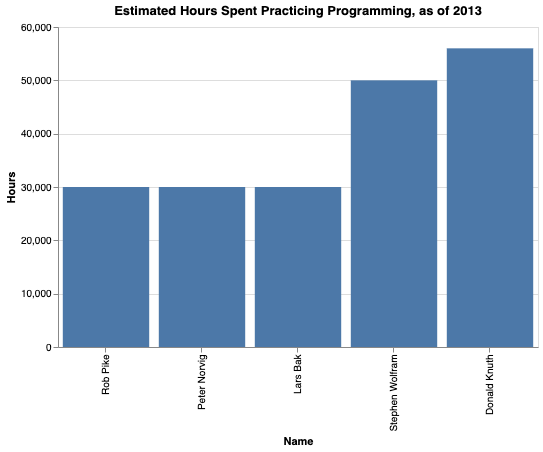

30000 Hours
-----------

In 2013 I sent around 50 emails to programmers whose work I admired asking them "Would you be willing to share the # of hours you have spent practicing programming? Back of the envelope numbers are fine!". Some of the emails bounced back, some went unanswered, but 5 people wrote back.

I promised people I would compile the responses and publish the results to the public domain. However, while waiting for more responses to trickle in, I slowly forgot about this project.

Then, this morning (7/18/2019), I stumbled upon one of those old emails.

Sorry for the delay! I know this turned out to be a tiny study, but I still think the results are interesting (and encouraging to aspiring programmers!):

|Name|WikipediaPage|GitHubId|Hours|YearOfEstimate|BornIn|
|-|-|-|-|-|-|
|Donald Knuth|https://en.wikipedia.org/wiki/Donald_Knuth||56000|2013|1938|
|Rob Pike|https://en.wikipedia.org/wiki/Rob_Pike|robpike|30000|2013|1956|
|Peter Norvig|https://en.wikipedia.org/wiki/Peter_Norvig|norvig|30000|2013|1956|
|Stephen Wolfram|https://en.wikipedia.org/wiki/Stephen_Wolfram|StephenWolfram|50000|2013|1959|
|Lars Bak|https://en.wikipedia.org/wiki/Lars_Bak_(computer_programmer)|larsbak|30000|2013|1965|

My Conclusion
-------------

No evidence has been found that the 10,000 hour strategy is flawed. :)

Thank You
---------

I can't put into words how grateful I am to the people who responded to me. At the time I was 5 years into my programming career, had passed 10,000 hours of practice, and was starting to worry that the "10,000 hour strategy" I had been following and telling other aspiring programmers to follow may have been hopeless, because I was still a pretty terrible programmer at the time (many would argue that today, 6 years later, I'm still bad, but now I can say that's just because I'm 31 hours short of 30k ;P). Then these busy coders answered my cold emails with not just a number but many encouraging words and thoughts. One of my favorite responses was from Peter Norvig, who sent me a Lisp program computing his estimate:

    # sum(years *  (hours/week)) * (weeks/year) 
    
    (4 * 10 # college
    + 2 * 30 # first job
    + 5 * 20 # grad school
    + 6 * 20 # faculty, research faculty
    + 6 * 25 # programming jobs
    + 15 * 10 # management jobs
    ) * 48

Thank you everyone!

Contribute
----------

Please feel free to send pull requests with your own data added to "data.csv".

License
-------

This is released to the public domain.
